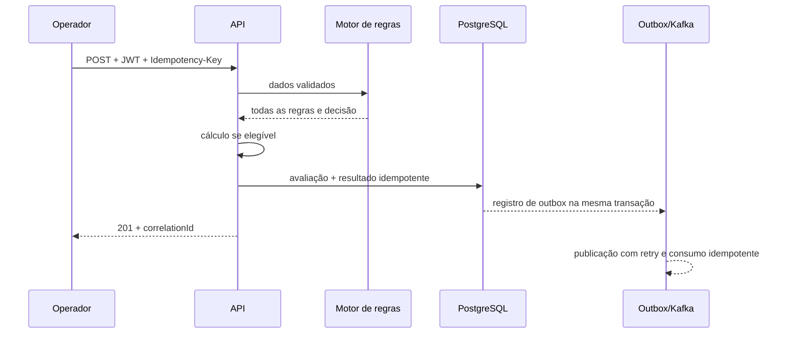
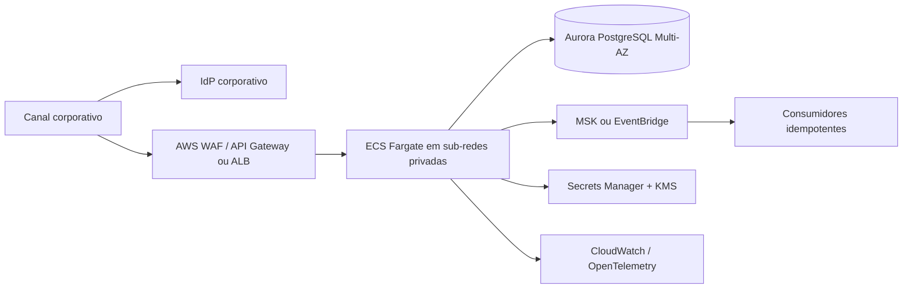

# Arquitetura

## Organização atual

A solução é um monólito modular com dependências apontando para dentro:

```text
web / persistence / messaging / security / report
                    ↓
           application (casos de uso e portas)
                    ↓
              domain (regras e cálculo)
```

O domínio não importa Spring nem JPA. A camada de aplicação orquestra a avaliação e define portas. Infraestrutura implementa HTTP, PostgreSQL, OAuth/OIDC, PDF, outbox, Kafka e observabilidade.

## Fluxo da avaliação



O CPF completo é usado somente durante o processamento necessário. Persistência, eventos, relatórios e respostas usam identificação mascarada; dados sensíveis adicionais devem ser cifrados com chaves externas.

## Controles operacionais

- OIDC/JWT e autorização por escopo;
- HTTPS obrigatório no perfil de produção;
- idempotência com retenção de 24 horas e detecção de payload divergente;
- transactional outbox para evitar dual write;
- correlação em resposta, MDC, decisão e evento;
- métricas sem CPF/evaluationId como tag;
- liveness do processo separada da readiness de dependências;
- erros técnicos sem stack trace no contrato HTTP.

## Evolução para AWS



Começar com ECS/Fargate reduz a carga operacional sem impedir imagens OCI ou posterior migração para EKS. Aurora mantém consistência transacional para avaliação, idempotência e outbox; DynamoDB é uma opção futura para projeções ou idempotência de altíssimo volume, não a fonte de verdade inicial.

Implantação recomendada: múltiplas tasks em duas ou mais AZs, autoscaling por CPU/latência/throughput, Aurora Multi-AZ com PITR, deploy canário ou blue/green, migrations como etapa controlada, segredos fora da imagem, tráfego privado, WAF/rate limit e alarmes por SLO. Relatórios grandes podem evoluir para geração assíncrona e armazenamento cifrado em S3 com URL assinada curta.

## Trade-offs e limites

O monólito modular prioriza consistência e velocidade de evolução. Separar serviços cedo adicionaria transações distribuídas e operação sem uma fronteira de escala comprovada. A extração natural, se necessária, é publicação/relatórios, preservando eventos versionados. O teste de carga define um objetivo, mas somente um ensaio em infraestrutura dimensionada comprova capacidade.
