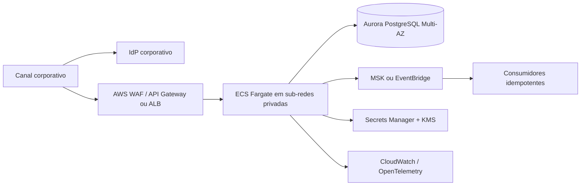

# Arquitetura

## Organização atual

A solução é um monólito modular Spring Boot organizado pela feature principal de avaliação. As dependências de negócio apontam para dentro:

```text
creditflow
├── evaluation
│   ├── domain
│   │   ├── calculation
│   │   └── rule
│   ├── application
│   │   ├── port
│   │   ├── event
│   │   └── report
│   └── infrastructure
│       ├── idempotency
│       ├── messaging
│       ├── observability
│       ├── outbox
│       ├── persistence
│       ├── report
│       └── web
│           ├── controller
│           ├── dto
│           ├── error
│           └── mapper
└── platform
    ├── config
    ├── health
    ├── observability (correlação)
    ├── privacy
    ├── security
    └── web

tools
└── load-test-report (CLI e PDF de evidência, fora do artefato produtivo)
```

Os caminhos de referência são `evaluation/domain`, `evaluation/application`, `evaluation/application/event`, `evaluation/infrastructure` e `creditflow/platform`. Idempotência, mensageria, outbox e métricas de crédito pertencem à feature — em especial `evaluation/infrastructure/messaging` e `evaluation/infrastructure/outbox`; bootstrap Spring, segurança, saúde e correlação ficam em `platform`. Os testes de domínio e aplicação espelham os pacotes de produção, enquanto as integrações transversais preservam seus agrupamentos de contrato. Cada tipo público ou interno de nível superior fica em um arquivo próprio e de mesmo nome.

O domínio contém modelos, regras e cálculo sem Spring, JPA ou Jackson. A aplicação usa o domínio diretamente e define portas somente para recursos externos: persistência, idempotência, métricas e geração do PDF. Os adaptadores da feature implementam HTTP, PostgreSQL, relatório, mensageria e outbox. Bootstrap Spring, segurança, saúde e correlação permanecem transversais sob `platform`.

## Fluxo da avaliação

```text
controller → caso de uso → domínio
                       ↓
                portas de saída
                       ↑
          PostgreSQL / idempotência / PDF
```

O controller valida o contrato HTTP e converte DTOs por meio do mapper. `CreateCreditEvaluationUseCase` coordena idempotência e métricas; `EvaluateRevolvingCreditUseCase` executa diretamente `RuleEngine` e `CreditLimitCalculator`, monta `CreditEvaluation` e solicita sua persistência. No mesmo limite transacional, o adaptador PostgreSQL cria a entrada da outbox serializando `CreditEvaluationCompleted`; o contrato do evento fica definido pela classe Kotlin, e não por uma segunda estrutura em SQL. Os controllers não acessam repositórios, serializadores nem geradores de relatório.

O CPF completo e o nome existem apenas no comando transitório necessário à entrada. O contexto das regras recebe somente atributos financeiros e de risco. Persistência, eventos, relatórios e respostas usam identificação mascarada. O modelo tipado do domínio é compartilhado com a aplicação; JSON e JPA ficam restritos aos adaptadores.

Relatórios síncronos usam um instante final fixo para manter a paginação estável e aceitam no máximo 10.000 avaliações. Acima desse volume, a API solicita filtros mais restritos; uma evolução para exportações maiores deve usar processamento assíncrono e armazenamento de objetos.

## Controles operacionais

- OIDC/JWT e autorização por escopo;
- CSP restritiva e dependências visuais servidas pelo próprio artefato;
- HTTPS obrigatório no perfil de produção;
- idempotência com retenção de 24 horas e detecção de payload divergente;
- transactional outbox para evitar dual write, com backoff, limite de dez tentativas e estado terminal `FAILED`;
- correlação em resposta, MDC, decisão e evento;
- métricas sem CPF ou `evaluationId` como tag;
- rate limiting por IP no AWS WAF associado ao ALB;
- liveness do processo separada da readiness de dependências;
- erros técnicos sem stack trace no contrato HTTP.

### Logs estruturados e diagnóstico

O appender de console usa Logstash JSON. Cada linha possui `@timestamp`, `level`, `logger_name`, `message`, `service.name`, `service.version` e `service.environment`; os campos MDC `correlationId`, `traceId` e `spanId` são incluídos quando estiverem no contexto. A identidade do serviço vem de `spring.application.name`, `APP_VERSION` e `APP_ENVIRONMENT`.

O `correlationId` conecta HTTP, outbox e Kafka. A pessoa operadora deve pesquisar esse campo pelo valor exato no agregador de logs ou usar `docker compose logs app | Select-String '"correlationId":"<correlationId>"'` localmente. O nível `DEBUG` representa sucesso nominal detalhado; `INFO`, marcos operacionais como duplicatas; `WARN`, retentativas e falhas tratadas; e `ERROR`, falhas técnicas. Para conter o volume, sucessos de avaliação e publicação não produzem um log `INFO` por item.

A fronteira de privacidade proíbe CPF, token, valores financeiros, corpo de requisição e payload de evento nos logs próprios. A configuração JSON exclui `cpf`, `token`, `amount`, `requestBody` e `payload`; os emissores devem registrar somente identificadores, tipos de falha e outros campos operacionais seguros.

## Evolução para AWS



ECS/Fargate reduz a carga operacional sem impedir uma migração posterior para EKS. Aurora preserva a consistência transacional de avaliação, idempotência e outbox. DynamoDB permanece uma opção futura para projeções ou idempotência de volume muito alto.

## Trade-offs e limites

O monólito modular prioriza consistência e velocidade de evolução. Separar serviços cedo adicionaria transações distribuídas sem uma fronteira de escala comprovada. Publicação e relatórios são candidatos naturais a extração futura, preservando eventos versionados.
